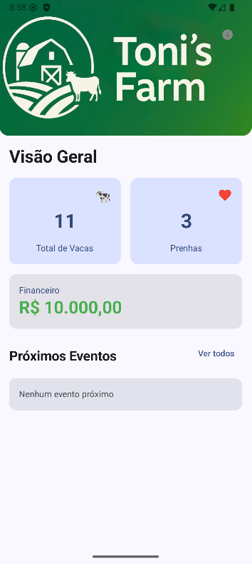
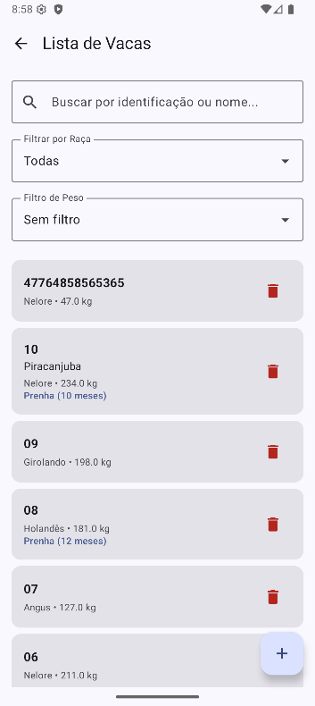
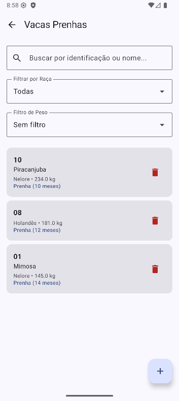
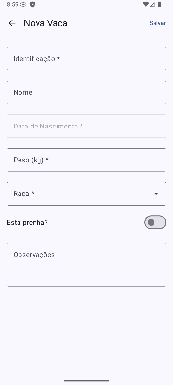
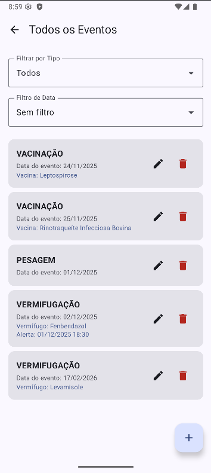
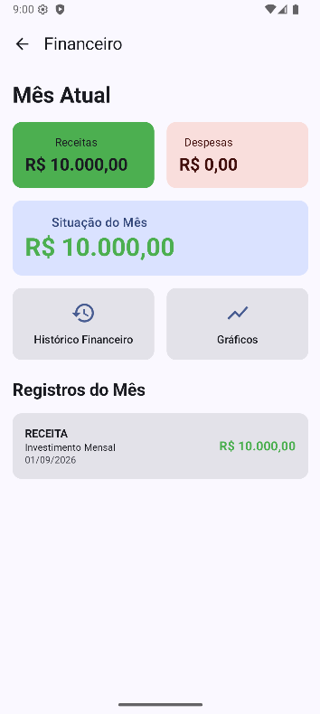
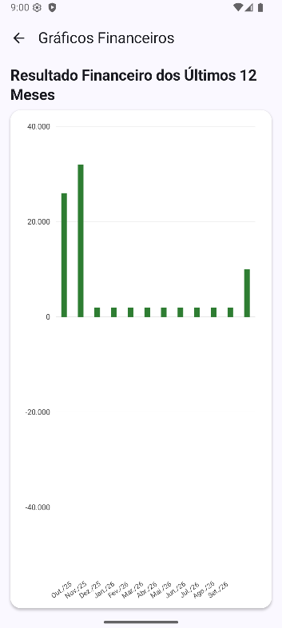
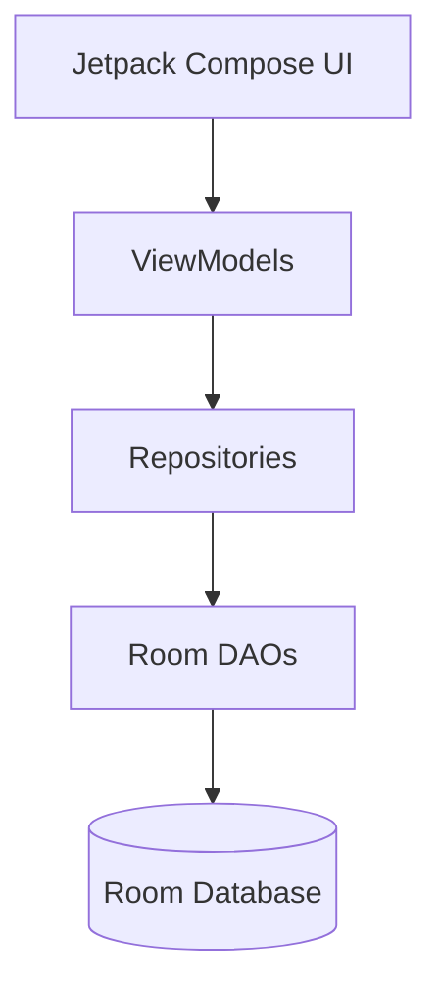

# Toni's Farm

An offline Android application designed to support the management of a family-owned cattle farm.

Toni's Farm was created as a personal project to centralize cattle records, health events, reproductive information, scheduled activities, and financial management in a single mobile application.

The project was developed independently in Kotlin using modern Android development technologies and was designed to work fully offline.

> **Status:** Functional prototype under active development.  
> The application was originally designed for real use on my family's farm, but daily farm operations were paused before deployment. Further adaptations are planned before production use.

---

## Features

### Cattle Management

- Register and manage cattle individually
- Store identification, name, breed, birth date, weight, and observations
- Track pregnancy status and pregnancy duration
- Search cattle by identification or name
- Filter cattle by breed and weight
- View pregnant cattle separately
- Maintain individual historical information for each animal

### Health & Reproductive Records

The application maintains historical records for cattle, including:

- Vaccinations
- Deworming
- Weight measurements
- Calving records

Events can be associated with one or multiple cattle, allowing farm-wide activities to be managed without duplicating information manually.

### Event Management

Create and manage farm events such as:

- Vaccinations
- Deworming
- Weighing
- Calving
- Other custom events

The application supports scheduled alerts and background processing for upcoming and completed events.

### Financial Management

- Register income and expenses
- Organize financial transactions
- Track monthly financial results
- View financial history
- Generate recurring transactions
- Visualize financial performance through charts
- Monitor the current farm balance directly from the dashboard

### Offline Operation

Toni's Farm was designed to operate without requiring an internet connection.

All application data is stored locally using Room Database, allowing farm information to remain available even in locations with limited or unavailable connectivity.

---

## Screenshots

### Dashboard

<p align="center">
  
</p>

### Cattle Management

<p align="center">
  
  
  
</p>

### Events

<p align="center">
  
</p>

### Financial Management

<p align="center">
  
  
</p>

---

## Tech Stack

| Technology | Purpose |
|---|---|
| Kotlin | Main programming language |
| Jetpack Compose | Native Android user interface |
| Material 3 | UI components and design system |
| Room | Local relational database |
| Hilt | Dependency injection |
| Kotlin Coroutines | Asynchronous operations |
| Flow / StateFlow | Reactive state and data management |
| WorkManager | Background processing |
| AlarmManager | Scheduled notifications and events |
| Navigation Compose | Application navigation |
| Android Studio | Development environment |

---

## Architecture

The application follows a layered architecture that separates the user interface, application state, business logic, and persistence layers.



ViewModels expose application state to the Compose UI, while repositories provide an abstraction between application logic and the Room persistence layer.

Kotlin Coroutines and Flow/StateFlow are used for asynchronous operations and reactive data handling.

---

## Data Model

The local database stores information related to:

- Cattle
- Events
- Cattle-event relationships
- Financial transactions
- Vaccinations
- Deworming
- Weight records
- Calving records

Room is used to model relationships between these entities and persist all application data locally.

This structure allows the application to keep historical health, reproductive, and financial information while maintaining relationships between farm events and individual animals.

---

## Background Processing

The application uses Android background-processing mechanisms to support event-related functionality.

- **AlarmManager** is used for scheduled alerts.
- **WorkManager** supports background event processing and fallback execution.
- Completed events can update historical animal records when appropriate.
- Scheduled activities can continue to be processed without requiring the application to remain open.

---

## Project Motivation

This project originated from a real need within my family.

My father manages a cattle farm, and I wanted to build a custom application tailored specifically to the information and workflows he needed rather than relying on generic farm-management software.

The goal was to create a simple, offline-first tool capable of centralizing cattle information, health records, reproductive data, scheduled events, and financial management.

The application was developed independently as a personal project.

Although farm activities were temporarily paused before the application entered daily use, the project remains under development and will be adapted further when operations resume.

---

## Running the Project

### Requirements

- Android Studio
- Android SDK
- JDK compatible with the project's Gradle configuration

### Installation

1. Clone the repository:

```bash
git clone https://github.com/JoaoPedro1212/TonisFarm.git
```

2. Open the project in Android Studio.

3. Allow Gradle to synchronize the project.

4. Select an Android emulator or connect a physical Android device.

5. Run the application.

The core functionality of Toni's Farm does not require an external server or internet connection.

---

## Future Improvements

Planned improvements include:

- Expanding automated test coverage
- Improving database migration coverage
- Refining dependency injection throughout the project
- Adding additional farm-management functionality based on real-world usage
- Expanding reports and financial analytics
- Improving user experience based on field testing
- Preparing the application for daily production use

---

## Author

**João Pedro Moura Penafiel de Angelo**

Computer Engineering student at Insper  
São Paulo, Brazil

- GitHub: [JoaoPedro1212](https://github.com/JoaoPedro1212)
- LinkedIn: [João Pedro Moura Penafiel de Angelo](https://www.linkedin.com/in/jo%C3%A3o-pedro-moura-penafiel-02038922b/)